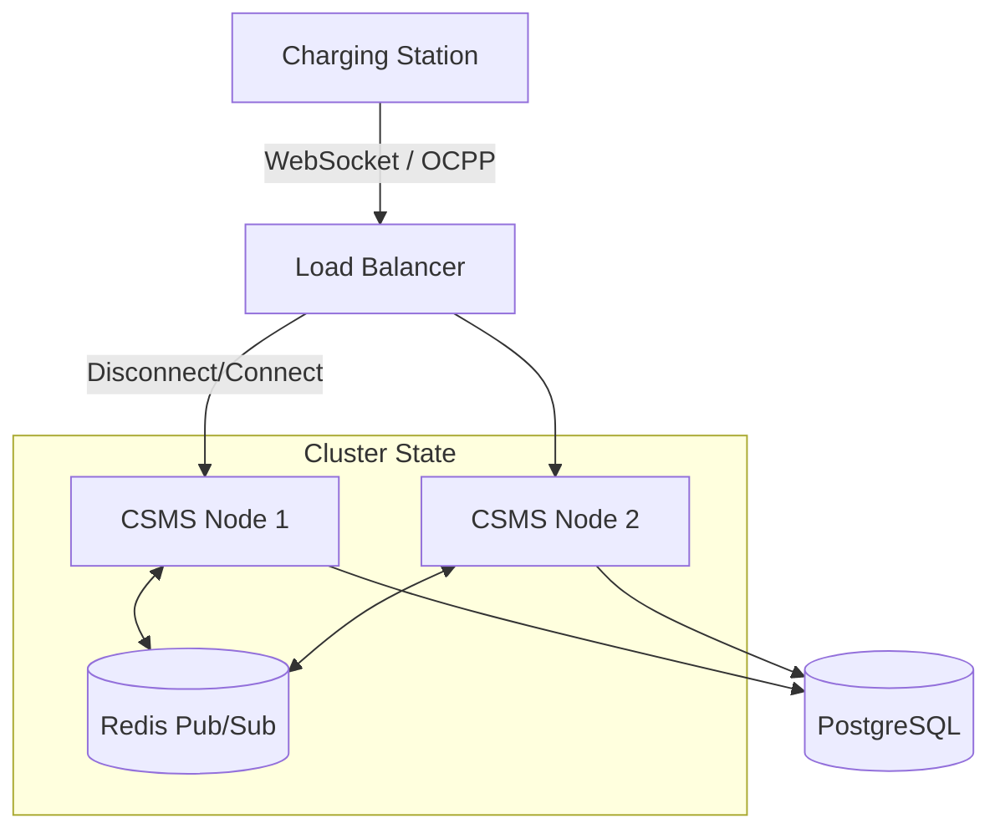

Building a Charging Station Management System (CSMS) is one of the most common yet challenging tasks in the EV infrastructure space. You aren't just building a web server; you're building a real-time control system that manages high-voltage hardware, processes financial transactions, and ensures driver safety.

In this deep-dive tutorial, we will move beyond "Hello World" and look at how to architect a production-grade CSMS using `ocpp-ws-io`.

## 1. The Architecture

A production CSMS typically consists of several layers:

1.  **Connectivity Layer**: Handles WebSocket connections, TLS termination, and OCPP message framing. This is where `ocpp-ws-io` shines.
2.  **Logic Layer**: Validates rules (e.g., "Can this user charge here?", "Is this station licensed?").
3.  **Data Layer**: Stores persistent state (Sessions, Meter Values, CDRs).



## 2. Project Setup

Let's start with a solid TypeScript foundation.

```bash
mkdir my-csms
cd my-csms
npm init -y
npm install ocpp-ws-io ioredis
npm install -D typescript @types/node tsx
npx tsc --init
```

Update your `tsconfig.json` to enable `experimentalDecorators` and `emitDecoratorMetadata` if you plan to use an ORM like TypeORM, but for this guide, we'll focus on the raw logic.

## 3. The Connectivity Layer

We'll create a server that listens on port 3000 and supports both OCPP 1.6 and 2.0.1.

```typescript title="src/server.ts"
import { OCPPServer } from "ocpp-ws-io";

const server = new OCPPServer({
  // Listen for both popular protocol versions
  protocols: ["ocpp1.6", "ocpp2.0.1"],
  // Strict mode validates every payload against the JSON Schema
  strictMode: true,
  // Custom logger for better visibility
  logger: console,
});

server.listen(3000).then(() => {
  console.log("🚀 CSMS is running on port 3000");
});
```

### Implementing Authentication

The `auth` hook is your first line of defense. In production, you typically check the `identity` (Device ID) against a database and verify the Basic Auth password.

```typescript
server.auth(async (accept, reject, handshake) => {
  const { identity, password } = handshake;

  // 1. Fetch station from DB
  const station = await db.stations.findOne({
    where: { chargePointId: identity },
  });

  if (!station) {
    console.warn(`[Auth] Unknown station tried to connect: ${identity}`);
    return reject(404, "Station not found");
  }

  // 2. Validate Password (if using Basic Auth / Profile 1 or 2)
  if (station.password && station.password !== password) {
    return reject(401, "Invalid password");
  }

  // 3. Accept connection and attach metadata to the client session
  accept({
    session: {
      tenantId: station.tenantId,
      model: station.model,
    },
  });
});
```

## 4. Handling Core Operations

The heartbeat of any CSMS is the... well, `Heartbeat`. But the real business value comes from Transactions.

### Boot Notification

When a charger powers up, it sends `BootNotification`. You should use this to:

1.  Update the station's firmware version in your DB.
2.  Set the `heartbeatInterval` (don't set it too low, or you'll DDoS yourself).
3.  Synchronize the clock.

```typescript
server.on("client", (client) => {
  // We use the generic handler to support both 1.6 and 2.0.1 with one function
  // logic, or we can be specific. Let's be specific for 1.6 here.

  client.handle("ocpp1.6", "BootNotification", async ({ params }) => {
    console.log(`[Boot] ${client.identity} sent boot notification`);

    // Update DB
    await db.stations.update({
      where: { chargePointId: client.identity },
      data: {
        firmwareVersion: params.firmwareVersion,
        lastSeen: new Date(),
      },
    });

    return {
      status: "Accepted",
      currentTime: new Date().toISOString(),
      interval: 300, // 5 minutes
    };
  });
});
```

### The Transaction Flow (Start -> Meter -> Stop)

This is the most critical flow. Errors here mean lost revenue.

#### 1. Authorize

Before starting, checks if the RFID tag is valid.

```typescript
client.handle("ocpp1.6", "Authorize", async ({ params }) => {
  const tag = await db.tags.findOne({ where: { uid: params.idTag } });

  if (!tag || !tag.active) {
    return { idTagInfo: { status: "Invalid" } };
  }

  // optional: check if tag is expired
  if (tag.expiryDate && new Date() > tag.expiryDate) {
    return { idTagInfo: { status: "Expired" } };
  }

  return {
    idTagInfo: {
      status: "Accepted",
      parentIdTag: tag.parentIdTag,
    },
  };
});
```

#### 2. StartTransaction

The charger has locked the cable and started offering power. We **MUST** generate a unique transaction ID here.

```typescript
client.handle("ocpp1.6", "StartTransaction", async ({ params }) => {
  console.log(`[Start] ${client.identity} on Connector ${params.connectorId}`);

  try {
    const transaction = await db.transactions.create({
      data: {
        chargePointId: client.identity,
        connectorId: params.connectorId,
        idTag: params.idTag,
        startTime: params.timestamp,
        meterStart: params.meterStart,
        status: "Active",
      },
    });

    return {
      transactionId: transaction.id, // Using the DB ID as the OCPP Transaction ID
      idTagInfo: { status: "Accepted" },
    };
  } catch (err) {
    // If DB fails, we should decline the transaction to prevent free charging
    return {
      transactionId: 0,
      idTagInfo: { status: "Blocked" },
    };
  }
});
```

#### 3. MeterValues

Chargers send these periodically (e.g., every minute). You normally just log these for charts.

```typescript
client.handle("ocpp1.6", "MeterValues", async ({ params }) => {
  // Bulk insert usually for performance
  await db.meterReadings.createMany({
    data: params.meterValue.map((mv) => ({
      transactionId: params.transactionId,
      timestamp: mv.timestamp,
      value: mv.sampledValue[0].value, // simplified
      unit: mv.sampledValue[0].unit || "Wh",
    })),
  });

  return {};
});
```

#### 4. StopTransaction

The session is over. Calculate the cost and finalize the CDR (Call Detail Record).

```typescript
client.handle("ocpp1.6", "StopTransaction", async ({ params }) => {
  console.log(`[Stop] Transaction ${params.transactionId}`);

  await db.transactions.update({
    where: { id: params.transactionId },
    data: {
      stopTime: params.timestamp,
      meterStop: params.meterStop,
      stopReason: params.reason,
      status: "Finished",
    },
  });

  // Async job: Send receipt to user, trigger OCPI CDR push, etc.

  return {
    idTagInfo: { status: "Accepted" },
  };
});
```

## 5. Scaling Out (Clustering)

When you deploy this to Kubernetes, you might run 10 replicas. A charger connected to **Pod A** might need a command triggered by an API call hitting **Pod B**.

`ocpp-ws-io` uses Redis to solve this transparently.

```typescript
import { RedisAdapter } from "ocpp-ws-io/adapters/redis";
import Redis from "ioredis";

// 1. Setup Redis
const pub = new Redis(process.env.REDIS_URL);
const sub = new Redis(process.env.REDIS_URL);

// 2. Pass adapter to server
const server = new OCPPServer({
  adapter: new RedisAdapter(pub, sub),
});

// 3. That's it.
```

Now, if you use the `Broadcast` feature or `RemoteStartTransaction` via an API endpoint, the library handles routing the message to the correct pod that holds the WebSocket connection.

## 6. Sending Commands to Chargers

To control a charger (e.g., from an Admin Dashboard), you can use the `call` method.

```typescript
// Somewhere in your REST API
app.post("/api/chargers/:id/unlock", async (req, res) => {
  const { id } = req.params;
  const { connectorId } = req.body;

  // Find the client (works across the cluster!)
  const client = server.repository.get(id);

  if (!client) {
    return res.status(404).json({ error: "Charger not connected" });
  }

  try {
    const response = await client.call("ocpp1.6", "UnlockConnector", {
      connectorId: connectorId,
    });

    if (response.status === "Unlocked") {
      res.json({ success: true });
    } else {
      res.status(400).json({ error: "Unlock failed", details: response });
    }
  } catch (timeout) {
    res.status(504).json({ error: "Charger did not respond" });
  }
});
```

## Summary

You now have a CSMS that:

1.  Secures connections with Auth.
2.  Persists charging data to a database.
3.  Scales horizontally using Redis.
4.  Exposes an API to control chargers.

This is the foundation of a real-world EV network. From here, you can add Smart Charging profiles, OCPI roaming, and billing integration.
